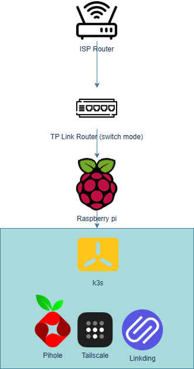

# Home Kubernetes Platform on Raspberry Pi

This repository documents a real-world Kubernetes environment running on Raspberry Pi hardware.

It focuses on practical infrastructure design, operational decision-making, and security under resource and network constraints commonly found in residential environments.

This is not a tutorial repository.  
It is a documented system.

## What this is

- A single-node k3s cluster
- Running continuously on ARM hardware
- Hosting real services used daily
- Designed with security and maintainability in mind

All workloads are deployed using raw Kubernetes manifests.

## What this demonstrates

- Kubernetes fundamentals in constrained environments
- Network and DNS architecture decisions
- Security-first thinking without overengineering
- Trade-off analysis and operational judgement
- Incremental platform design

## Repository structure

- `docs/`  
  High-level system design and architecture

- `k3s/`  
  Cluster bootstrapping, node roles, and scaling plans

- `services/`  
  Service-specific documentation

- `examples/`  
  Reference Kubernetes manifests

- `lessons-learned/`  
  Mistakes, improvements, and future work

## Current status

- Single Raspberry Pi 3 B+ node
- k3s with reduced default components
- Pi-hole, Tailscale, and Linkding deployed
- No public ingress
- Remote access via encrypted overlay network

## Future plans

- Introduce Raspberry Pi 5
- Add external SSD-backed storage
- Expand to multi-node cluster
- Improve observability and backups

These plans are documented but intentionally not rushed.

## Audience

This repository is aimed at:

- DevOps engineers
- Platform engineers
- Hiring managers
- Anyone interested in pragmatic infrastructure design

It assumes prior familiarity with Kubernetes and Linux.
